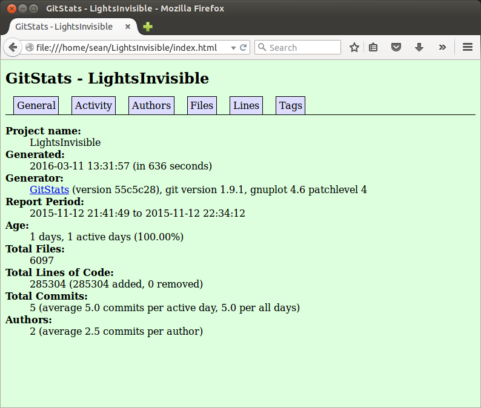

##LightsInvisible##

#####[https://github.com/tli5/LightsInvisible.git](https://github.com/tli5/LightsInvisible.git)#####

contributors: 1

number of lines of code: 106254 total

the first commit: @tli5 first commit tli5 committed on Nov 12, 2015

the latest commit:Boat tli5 committed on Nov 12, 2015

the current branches: master

####GitStats####

####gource video:####

#####[https://youtu.be/N4J2c5gRK1M](https://youtu.be/N4J2c5gRK1M)#####

Is there a leader for each of the five projects? Who would you call the leader?

  since there is only one contributor, Taoran (Tom) Li must be the leader
  
